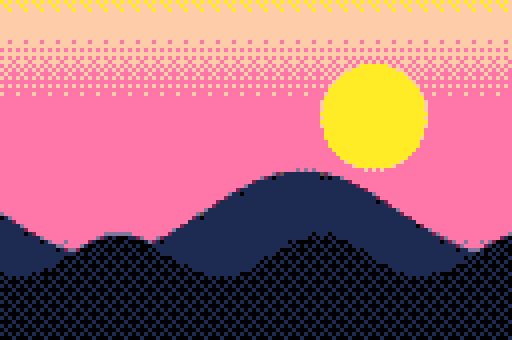
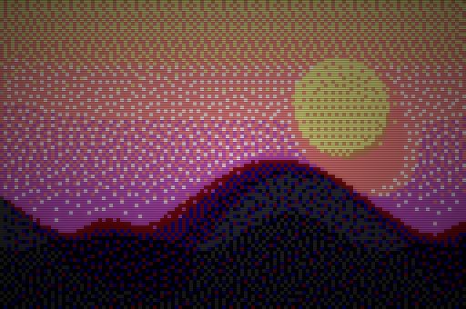

# PIXELATE

```
██████╗ ██╗██╗  ██╗███████╗██╗      █████╗ ████████╗███████╗
██╔══██╗██║╚██╗██╔╝██╔════╝██║     ██╔══██╗╚══██╔══╝██╔════╝
██████╔╝██║ ╚███╔╝ █████╗  ██║     ███████║   ██║   █████╗
██╔═══╝ ██║ ██╔██╗ ██╔══╝  ██║     ██╔══██║   ██║   ██╔══╝
██║     ██║██╔╝ ██╗███████╗███████╗██║  ██║   ██║   ███████╗
╚═╝     ╚═╝╚═╝  ╚═╝╚══════╝╚══════╝╚═╝  ╚═╝   ╚═╝   ╚══════╝
        retro pixel art from any image  ·  v1.0.0
```

[](https://www.python.org/downloads/)
[](LICENSE)
[](https://github.com/psf/black)
[](https://python-pillow.org/)

> Turn any image into authentic retro pixel art using classic gaming palettes (Game Boy, NES, C64, ZX Spectrum, PICO-8…), four dithering algorithms, and optional CRT glow + scanlines. Or print it as ANSI art straight to your terminal.

---

## Gallery

| Source | Game Boy | PICO-8 (Bayer) | C64 + CRT |
|:---:|:---:|:---:|:---:|
|  |  |  |  |
| original | `--palette gameboy` | `--palette pico8 --dither bayer` | `--palette c64 --crt --scanlines` |

---

## Why?

Modern image filters smooth everything out. PIXELATE goes the other way — it crushes color depth down to the exact palettes used by the consoles and home computers of the 80s and 90s, dithers cleverly to preserve detail, and gives you a finished pixel-art image that looks like it shipped on a cartridge.

## Features

- **12 retro palettes** — Game Boy DMG, Game Boy Pocket, NES, C64, ZX Spectrum, CGA, PICO-8, Apple II, sunset, mono-green/amber phosphor, grayscale.
- **4 dithering algorithms** — Floyd-Steinberg, Atkinson (Mac classic), Ordered Bayer, and no-dither flat quantization.
- **CRT effects** — soft bloom + corner vignette + horizontal scanlines for that authentic monitor look.
- **ASCII / ANSI mode** — render any image as colored terminal art.
- **Beautifully retro CLI** — green-on-black banner, palette previews, swatches, progress bars.
- **Clean Python API** — use it in your own scripts.
- **Input safety checks** — refuses empty or excessively large source images before expensive processing.

## Install

```bash
git clone https://github.com/Sebby1770/pixelate.git
cd pixelate
pip install -e .
```

Or just install the dependencies and run as a module:

```bash
pip install -r requirements.txt
python -m pixelate --help
```

## Usage

### Convert an image

```bash
pixelate convert photo.jpg --palette gameboy --pixel-size 96 --dither floyd
```

Crank up the retro:

```bash
pixelate convert photo.jpg \
  --palette nes \
  --pixel-size 128 \
  --dither atkinson \
  --upscale 4 \
  --crt --scanlines \
  -o photo_retro.png
```

### Render to ASCII

Drop an image straight into your terminal:

```bash
pixelate ascii photo.jpg --width 120 --ramp blocks
```

Save as plain text:

```bash
pixelate ascii photo.jpg --no-color -o art.txt
```

### Browse palettes

```bash
pixelate palettes          # list all built-in palettes
pixelate preview pico8     # print a color swatch
pixelate preview gameboy
```

## CLI reference

```
pixelate convert IMAGE [OPTIONS]
  -p, --palette       gameboy | nes | c64 | zx | cga | pico8 |
                      apple2 | sunset | mono-green | mono-amber |
                      gameboy-pocket | grayscale
  -s, --pixel-size    Resolution of longest side (8–1024)
  -d, --dither        none | floyd | atkinson | bayer
  -u, --upscale       1–16 (output pixels per logical pixel)
      --saturation    0.0–3.0 (pre-quantize boost)
      --crt           Apply CRT bloom + vignette
      --scanlines     Overlay horizontal scanlines
  -o, --output        Output path (default: <name>_pixel.png)

pixelate ascii IMAGE [OPTIONS]
  -w, --width         Output width in characters
  -r, --ramp          dense | blocks | classic | binary | <custom>
      --color         24-bit ANSI color (default on)
      --invert        Invert ramp (light terminals)
  -o, --output        Save to .txt
```

## Python API

```python
from pixelate import pixelate_image

img = pixelate_image(
    "photo.jpg",
    palette="pico8",
    pixel_size=128,
    dither="atkinson",
    upscale=4,
    crt=True,
    scanlines=True,
)
img.save("output.png")
```

```python
from pixelate.ascii_art import image_to_ascii

print(image_to_ascii("photo.jpg", width=80, ramp="blocks", color=True))
```

## How it works

1. **Resize** — the source image is downsampled with Lanczos to a low resolution (you control this — `pixel_size`). This is the actual "pixelation."
2. **Quantize** — every pixel is matched against the chosen palette using Euclidean distance in RGB.
3. **Dither** — quantization error is either spread to neighboring pixels (Floyd-Steinberg, Atkinson) or hidden in a deterministic pattern (Bayer).
4. **Upscale** — the small image is enlarged with nearest-neighbor so the pixels stay crisp and chunky.
5. **Effects (optional)** — scanlines and a CRT-style bloom-plus-vignette pass.

## Tests

```bash
pip install -e ".[dev]"
pytest
```

## Project layout

```
pixelate/
├── pixelate/
│   ├── __init__.py
│   ├── __main__.py
│   ├── cli.py          # Click CLI
│   ├── core.py         # Conversion pipeline
│   ├── palettes.py     # 12 retro palettes
│   ├── dithering.py    # FS, Atkinson, Bayer, none
│   ├── effects.py      # CRT, scanlines, vignette
│   ├── ascii_art.py    # ASCII / ANSI rendering
│   └── ui.py           # Rich-styled banner + tables
├── tests/
│   ├── test_palettes.py
│   ├── test_dithering.py
│   └── test_core.py
├── pyproject.toml
├── requirements.txt
├── LICENSE
└── README.md
```

## Roadmap

- [ ] Animated GIF input/output
- [ ] Custom palette files (.gpl / .hex)
- [ ] Sprite sheet export
- [ ] Web playground
- [ ] More dithering kernels (Stucki, Burkes, Sierra)

## License

MIT — see [LICENSE](LICENSE).

## Author

Made by [Seb (Sebby1770)](https://github.com/Sebby1770).
